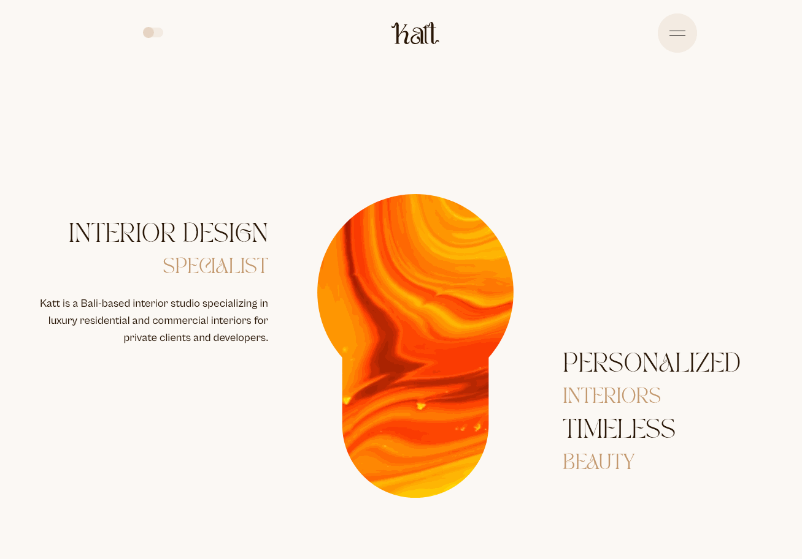
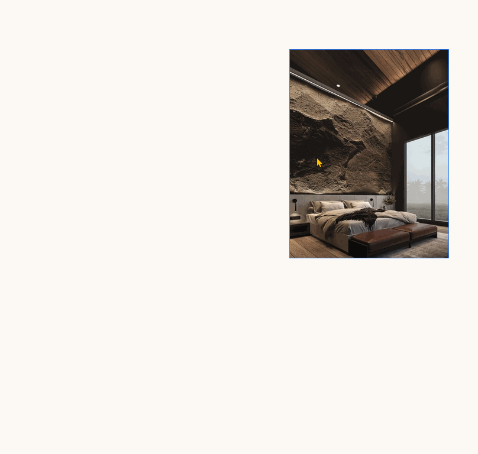

# Katt Interior — Interior Design Portfolio & Blog Platform

Katt Interior is an interior design portfolio and blogging platform built for interior designer.  
The platform focuses on **visual quality**, **performance**, **SEO**, and **content authoring usability** for non-technical users.

 
 

**Tech Stack:** Next.js (App Router), TypeScript, Supabase, Tailwind CSS, Radix UI, Resend

🌐 Live Site: https://kattinterior.vercel.app/

---

## Project Goals

The primary goals of this project were to:
- Deliver a **visually rich** website without sacrificing performance
- Provide a **simple content management experience** for non-technical users
- Implement **SEO best practices** to improve discoverability
- Build a maintainable and scalable front-end architecture suitable for long-term growth
- Collect client inquiries through a contact form for potential customers

---

## Key Features

- 🏡 **Interior Portfolio & Blog**
  - Image-centric project and article pages
  - Optimized layouts for visual storytelling

- ⚡ **Performance-Focused Rendering**
  - Server-Side Rendering (SSR) and Incremental Static Regeneration (ISR)
  - Optimized image loading for large, high-resolution assets

- ✍️ **Custom Blog Editor**
  - Drag-and-drop layout editor designed for non-technical users
  - SEO-friendly output with clean, semantic HTML

- 🔐 **Authentication & Authorization**
  - Supabase Auth with role-based access control
  - Row-Level Security (RLS) for data protection

- 🔍 **Search Engine Optimization**
  - JSON-LD structured data
  - Open Graph and social metadata
  - Automated sitemap generation
  - Core Web Vitals optimization

- 🎨 **Modern UI System**
  - Accessible components built with Radix UI
  - Utility-first styling with Tailwind CSS

---

## Architecture Overview

Katt Interior follows a **content-first, performance-aware architecture**.

### 1. Rendering Strategy
- Public-facing pages leverage **SSR and ISR** for fast initial loads and SEO benefits
- CSS is generated during rendering to place images correctly and ensure fully responsive layouts
- Content updates are regenerated incrementally without full redeployment

### 2. Image Optimization
- Aggressive image optimization for large visual assets before upload
- Responsive image sizes and modern image formats to balance quality and performance

### 3. Content Management
- Blog content is authored through a custom editor rather than a traditional CMS, making it suitable for clients who do not have time to learn complex CMS tools
- Layout data is stored in a structured format and rendered into clean, semantic HTML

### 4. Security Model
- Supabase RLS policies enforce authorization at the database level
- Access is restricted based on authenticated user roles, allowing administrators to invite additional users to help manage content

---
