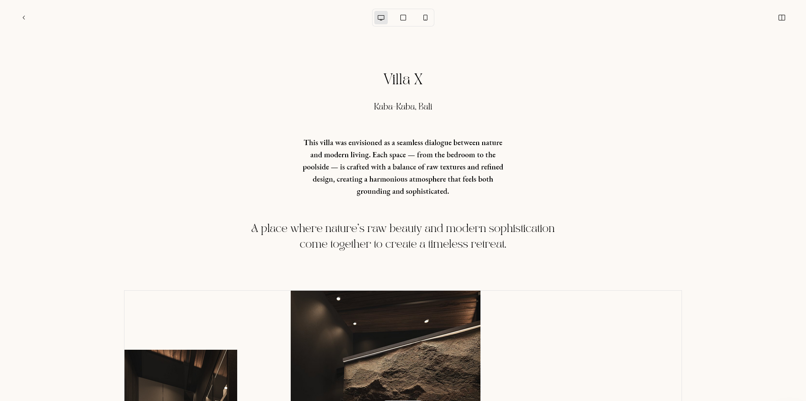

# Drag & Drop Blog CMS

A custom, easy-to-use blog **CMS** designed for kattinterior. 

Built with **Next.js**, **Supabase**, and **Tailwind**, it features drag-and-drop editing for simple content management, even for non-advanced users.

---

## ✨ Features

- 🖼️ **Drag-and-drop editor** – Manage images and layouts with ease  
- 📝 **Blog CMS** – Optimized for content with heavy image usage  
- 🔑 **Authentication** – Secure login with Supabase  
- 📱 **Responsive design** – Works across desktop, tablet and mobile  
- ⚡ **Built with Next.js** – Fast, SEO-friendly, and scalable
- 📧 **Contact management** - Automatic email and contact management

---

## 🚀 Demo

[Live Demo](https://kattinterior.vercel.app) <!-- replace with deployed URL -->

---

## 🛠️ Tech Stack

- [Next.js](https://nextjs.org/)
- [Supabase](https://supabase.com/)
- [Tailwind CSS](https://tailwindcss.com/)
- [Resend](https://resend.com/)